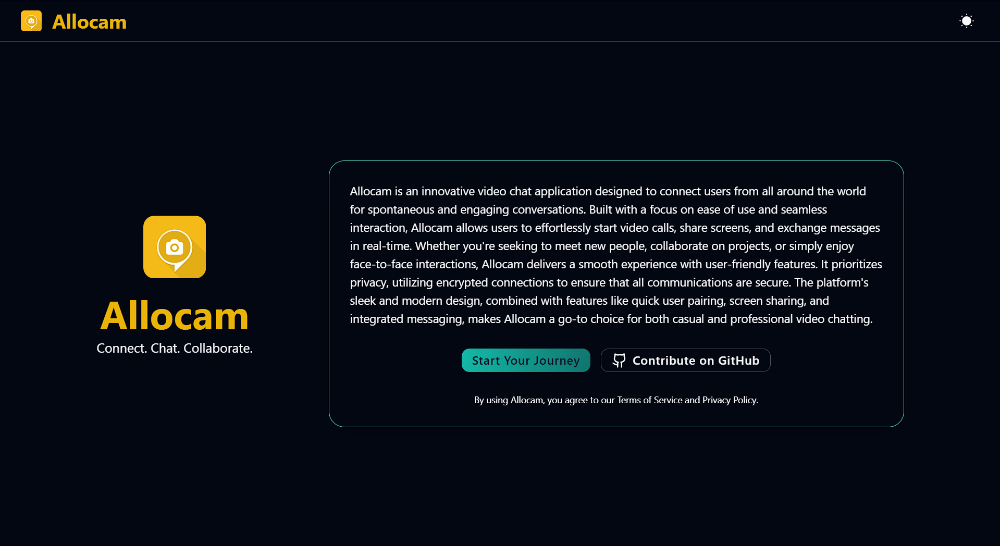

# 📸 Allocam (currently working / not in production)

[](http://allocam.vercel.app/)  
[Allocam](http://allocam.vercel.app/) is a real-time camera and streaming application designed for secure and responsive live video interactions. Built with **Vite**, **Node.js**, and **Socket.IO**, Allocam ensures minimal delay and a user-friendly interface.

---

 <!-- Replace with actual preview image URL -->

---

## 🔗 Table of Contents

- [Features](#features)
- [Demo](#demo)
- [Tech Stack](#tech-stack)
- [Project Structure](#project-structure)
- [Getting Started](#getting-started)
- [Usage](#usage)
- [Contributing](#contributing)
- [License](#license)

## ✨ Features

- 📹 **Real-time Video Streaming**: Low-latency streaming using Socket.IO.
- 🔒 **Privacy-Focused**: Secure and private data handling.
- ⚡ **Fast and Responsive**: Optimized frontend performance with Vite.
- 🧑‍🤝‍🧑 **User-Friendly Interface**: Simple and intuitive design.
- 🌐 **Cross-Platform Support**: Works seamlessly on various devices and browsers.

## 🎥 Demo

Try out the live demo: [Allocam Demo](http://allocam.vercel.app/)

## 🛠 Tech Stack

| Frontend | Backend | Deployment |
| --- | --- | --- |
|     |   |  |

---
## 🗂 Project Structure

```
allocam/
├── client/       # Frontend (Vite + React)
└── server/       # Backend (Node.js + Express + Socket.IO)
```

## 🚀 Getting Started

### Prerequisites

- Ensure you have [Node.js](https://nodejs.org/) and npm installed

### Installation

1. **Clone the repository**
   ```bash
   git clone https://github.com/codernotme/allocam.git
   cd allocam
   ```

2. **Install Dependencies**
   - Frontend:
     ```bash
     cd client
     npm install
     ```
   - Backend:
     ```bash
     cd ../server
     npm install
     ```

### Running the Application

1. **Start the Backend Server**
   ```bash
   cd server
   node index.js
   ```
   The server runs on `http://localhost:3000` by default.

2. **Start the Frontend Development Server**
   ```bash
   cd ../client
   npm run dev
   ```
   Access the frontend at `http://localhost:5173`.

### Configuration

- Set the backend URL in the frontend code (if needed) to `http://localhost:3000`.

## 📖 Usage

1. Open the app in your browser and grant camera permissions.
2. Use the UI to start/stop streaming and adjust settings as desired.
3. Explore the interface for real-time interaction features.

## 🤝 Contributing

Contributions are welcome! Here’s how you can get involved:

1. Fork the repository.
2. Create a feature branch (`git checkout -b feature/YourFeature`).
3. Commit your changes (`git commit -m 'Add new feature'`).
4. Push to your branch (`git push origin feature/YourFeature`).
5. Open a Pull Request on GitHub.

Check the [issues page](https://github.com/codernotme/allocam/issues) for any open issues or to report new ones.

## 📄 License

This project is licensed under the MIT License. See the [LICENSE](LICENSE) file for more information.

---

Thank you for using Allocam! If you enjoy this project, please consider giving it a star 🌟
